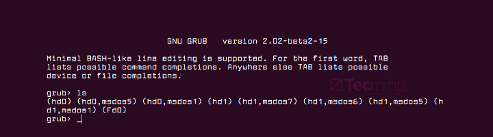

Linux
=====

# Оглавление

1. <h3>[Работа с файловой системой](#Работа-с-файловой-системой)</h3>

    - [Монтирование дисков](#Монтирование-дисков)

2. <h3>[Настройка системы](#Настройка-системы)</h3>

    - [Переустановка/восстановление загрузчика grub](#Переустановка/восстановление-загрузчика-grub)
    - [Активация "Quick Search" в synaptic](#Активация-"Quick-Search"-в-synaptic)

3. <h3>[Исправление ошибок](#Исправление-ошибок)</h3>

    - [Fix неправильного отображения иконки skype в tray](#Fix-неправильного-отображения-иконки-skype-в-tray)


  

<a name='Работа-с-файловой-системой'></a>
## Работа с файловой системой

<a name='Монтирование-дисков'></a>
### Монтирование дисков

Для того, чтобы примонтировать нужный диск из консоли, нужно выполнить 2 
простых действия:

- Посмотреть как ОС определила жесткий диск. Это можно сделать при помощи 
  команды
   
  ```bash
  sudo fdisk -l
  ```
  
- Теперь, увидев, какое имя присвоила ОС диску, его можно примонтировать к 
  нужной дирректории
  
  ```bash
  sudo mount -t ntfs /dev/sdb1 /media
  ```
  
  Данная команда примонтирует раздел диска c именем `sdb1` и файловой системой
  `ntfs` к папке `/media`.
  
Ответ нашел [здесь](https://askubuntu.com/questions/177825/how-to-mount-an-external-hdd)
  

<a name='Настройка-системы'></a>
## Настройка системы

<a name='Переустановка/восстановление-загрузчика-grub'></a>
### Переустановка/восстановление загрузчика grub

Иногда бывает, что после установки системы компьютер не загружается, а на экане
красуется окно загрузчика grub.



Есть 2 основных способа исправить данную ситуацию:

- восстановление Grub в rescue mode
- восстановление Grub с помощью утилиты Boot repair

**Восстановление Grub в rescue mode**

Если по каким-то причинам у вас нет доступа к LiveCD/USB-носителю, а также к 
компьютеру, с помощью которого этот самый носитель можно было бы сделать, то 
этот способ для вас.

Само восстановление проходит таким образом: сначала мы подгружаем все модули, 
чтобы открыть доступ ко всей функциональной части Grub, после чего запуститься 
с нужного раздела. Надо понимать, что Grub состоит из двух частей:

Одна из этих частей (первая) записана в MBR диска. В ней присутствует базовый
функционал и ничего больше (консоль в rescue mode).

Стало быть, нам нужно определить, в каком разделе находится вторая часть Grub 
(находится в каталоге /boot/grub), и после чего подгрузить все недостающие 
модули. А вот уже после этого мы сможем запустить загрузчик с нужного раздела. 
В rescue mode есть всего четыре команды:

```
ls
set
unset
insmod
```

Для начала вводим следующую команду:

```python
ls
```

В выводе будет что-то подобное:

```
(hd0) (hd0,msdos3) (hd0,msdos2) (hd0,msdos1) (hd1) (hd1,msdos2) (hd1,msdos1)
```

В некоторых случаях Grub неправильно опеределяет файловые системы находящиеся 
на разделах дисков. В данном примере загрузчик показывает их как msdos. Мы 
должны попытаться угадать диски, которые видим. В примере доступно два диска. 
Диск с индексом 0 содержащий три раздела, и диск с индексом 1 содержащий два 
раздела. Если вы знаете структуру своих дисков, определить нужный труда не 
составит.

В загрузчике Grub разделы нумеруются в обратном исчислении. Не очень ясно 
какой именно из разделов назван, к примеру (hd0,msdos3). Чтобы было более 
понятно, можно использовать вид (hd0,1). Если в грабе отсчет дисков идет с 0,
а разделов с 1, то можно определить, что операционная система установлена в 
первый раздел первого раздела - (hd0,1). Используем следующую команду:

```
set prefix=(hd0,1)/boot/grub 
set root=(hd0,1)
```

С помощью этих команд мы приказываем системе использовать какой-то конкретный
диск, для выполнения всех остальных операций (в нашем случае, это 
диск (hd0,1)). Чтобы проверить есть ли на данном диске загрузчик, введем эту 
команду:

```
ls /boot/grub
```

Если в выводе будет список файлов и папок, значит мы все сделали правильно. 
Теперь можно загрузить все необходимые модули. Для этого выполним команды:

```
insmod ext2
insmod normal
normal
```

После выполнения команд Grub загрузится в полнофункциональном режиме. Будут 
найдены все операционные системы, которые установлены на компьютере, после 
чего будет показано стандартное меню загрузки.

Чтобы закрепить результат (и не проделывать все то же самое после перезапуска
ПК), нужно зайти в терминал своего дистрибутива Linux, где с root правами 
выполнить следующую команду:

```bash
grub-install /dev/sdX
```

sdX - диск, на который должен быть установлен Grub. Так же стоит заметить,
что данная команда не всегда помогает исправить ситуацию. В этом случае 
необходимо прибегнуть к помощи утилиты Boot repair, которая описывается в этой
заметке отдельно.

Если операционная система расположена на разделе с файловой системой btrfs, 
то нам необходимо выполнить следующие команды:

```
set prefix=(hd0,1)/@/boot/grub
set root=(hd0,1)
```

И подгрузить модули:

```
insmod btrfs
insmod normal
```

Ну и теперь запустить GRUB:

```
normal
```

**Восстановление Grub с помощью утилиты Boot repair**

С помощью этой замечательной утилиты вы сможете восстановить загрузчик всего 
в пару кликов. Утилита имеет собственный GUI, ее использование не вызовет 
трудностей.

Чтобы установить boot repair, вы можете воспользоваться одним из приведенных 
способов:

- Запись и установка специального [образа диска Boot Repair](http://sourceforge.net/projects/boot-repair-cd/files/)
  (и дальнейшая загрузка с него)
- Установка Boot repair из PPA-репозитория в LiveCD/USB дистрибутиве или в 
  системе загруженной вручную из GRUB rescue mode
  
Если с первым способом все понятно: нужно просто скачать и записать образ с 
помощью соответствующих инструментов. То во втором уже нужно знать конкретные 
команды, которые выглядят следующим образом:

```bash
sudo add-apt-repository ppa:yannubuntu/boot-repair
sudo apt-get update && sudo apt-get install -y boot-repair
```

В утилите будет доступно два варианта на выбор:

*Recommended repair* исправляет большую часть известных ошибок, которые могли
бы возникнуть при запуске. С его помощью вы сможете пофиксить и загрузчик Grub.

*Create a BootInfo summary* создает Boot-Info-Script – скрипт, который 
позволяет диагностировать большинство проблем при загрузке.

Здесь же есть и *Advanced options*. Он включает в себя варианты для 
восстановления и настройки загрузчика Grub2 (загрузка по-умолчанию, опции 
загрузки ядра, отображение или скрытие GRUB при загрузке, удаление GRUB). 
С помощью этих же инструментов, вы можете восстановить MBR и т.д.

Вам обязательно стоит заглянуть на [официальный сайт](http://sourceforge.net/p/boot-repair/home/Home/)
Boot Repair. Там вы сможете найти более подробную информацию обо всех 
возможностях и особенностях программы. Там же будет доступна информация о 
выходе новых версий: фиксах и улучшениях самой утилиты, а также многом и 
многом другом.


[Оригинальная статья](https://omgubuntu.ru/nie-zaghruzhaietsia-linux-chinim-zaghruzchik-grub/)


<a name='Активация-"Quick-Search"-в-synaptic'></a>
### Активация "Quick Search" в synaptic

Иногда бывает, что по умолчанию "quick search" не активирован в synaptic и это 
очень неудобно. Для того, чтобы исправить это, нужно выполнить следующие команды:

```bash
sudo apt-get install apt-xapian-index
sudo update-apt-xapian-index -vf
```


<a name='Исправление-ошибок'></a>
## Исправление ошибок

<a name='Fix-неправильного-отображения-иконки-skype-в-tray'></a>
### Fix неправильного отображения иконки skype в tray

В некоторых оболочках значек skype в tray отображается как полтора маленьких
значка. Для того, чтобы это исправить, нужно:

- открыть файл `/usr/bin/skypeforlinux` в текстовом редакторе
- найти в нем строку 

  ```
  nohup "$SKYPE_PATH" --executed-from="$(pwd)" --pid=$$ "$@" > "$SKYPE_LOGS/skype-startup.log" 2>&1 &
  ```
  
- превести ее к следующему виду
  
  ```
  XDG_CURRENT_DESKTOP=Unity
  nohup "$SKYPE_PATH" --executed-from="$(pwd)" --pid=$$ "$@" > "$SKYPE_LOGS/skype-startup.log" 2>&1 &
  XDG_CURRENT_DESKTOP=MATE
  ```
  
Ответ нашел [здесь](https://github.com/mate-desktop/mate-panel/issues/793)